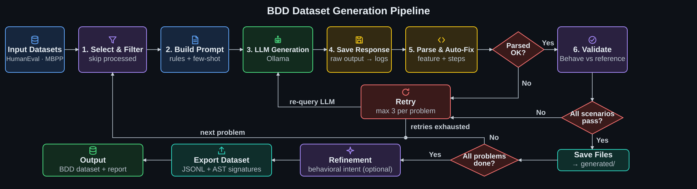

# BDD Dataset Generation Pipeline

A robust, modular toolkit for generating, validating, and refining **Behavior-Driven Development (BDD)** test specifications for algorithmic coding problems using Large Language Models (LLMs). 

This pipeline processes problems from the [HumanEval](https://github.com/openai/human-eval) and [MBPP](https://huggingface.co/datasets/google-research-datasets/mbpp) benchmarks, prompts an LLM (via [Ollama](https://ollama.com)) to generate Gherkin `.feature` files and Python [Behave](https://behave.readthedocs.io/) step definitions, and rigorously validates them against reference solutions.

## 🔬 Research Context

This repository is the data-generation engine for a research project investigating **Reinforcement Learning (RL) for code synthesis**. 
Specifically, it explores whether BDD-derived reward signals (executable Gherkin scenarios) improve LLM code generation quality compared to standard unit-test reward signals. The `validated_dataset/` produced by this pipeline serves as the foundational training corpus for RL fine-tuning pipelines (e.g., using HuggingFace TRL).

## ✨ Key Features

- **Multi-Dataset Support**: Normalizes HumanEval, MBPP, and custom unified-format datasets into a common `ProblemRecord` schema.
- **Thinking-Model Support**: Native handling of Ollama thinking/reasoning models (e.g., Qwen, DeepSeek) with automatic chain-of-thought fallback extraction.
- **Automated Auto-Fixers**: Post-processes LLM outputs to fix common hallucination bugs (e.g., invalid regex escapes, missing `use_step_matcher("re")`, Behave reserved context attributes).
- **Shared Validation Harness**: A unified Behave runner used across generation, revalidation, and refinement stages.
- **Tier-2 Behavioral Refinement**: An optional secondary LLM pass that rewrites Gherkin `When` steps to express *user-level behavioral intent* rather than function-call descriptions.
- **AST-Based Signature Extraction**: Accurately extracts target function signatures from reference solutions, ignoring helper functions.

## 🏗️ Architecture & Pipeline Flow



## 📂 Repository Structure

```text
bdd_dataset_pipeline/
├── run_pipeline.py          # Main entry point for dataset generation
├── revalidate.py            # Re-runs Behave and promotes passing problems
├── refine_dataset.py        # (Optional) Tier-2 LLM refinement for behavioral intent
├── export_dataset.py        # Exports validated_dataset/ to JSONL with signatures
│
├── bdd_pipeline/            # Core modular package
│   ├── loaders/             # HumanEval, MBPP, and custom dataset loaders
│   ├── prompts/             # Prompt templates and few-shot assets
│   ├── llm/                 # Ollama client and response extraction
│   ├── parsing/             # LLM output parsing and auto-fixers
│   ├── validation/          # Behave execution and output parsing
│   ├── orchestration/       # Pipeline runner, retry logic, and skip checks
│   ├── reporting/           # CSV and summary.txt generation
│   ├── refinement/          # Tier-2 behavioral intent refinement
│   ├── export/              # JSONL dataset exporter
│   ├── signatures.py        # AST-based function signature extraction
│   └── records.py           # ProblemRecord dataclass
│
├── tools/                   # Standalone utilities and legacy migration scripts
├── config.py                # Centralized configuration
├── dataset/                 # Source JSONL files (HumanEval, MBPP)
├── generated/               # Intermediate LLM outputs
├── validated_dataset/       # Problems that passed Behave validation
├── refined_dataset/         # (Optional) Problems with refined behavioral intent
├── enhanced_dataset/        # Final exported JSONL datasets
└── results/                 # CSV reports and summaries
```

## ⚙️ Installation & Setup

### 1. Environment Setup
Python 3.10+ is recommended.
```bash
python -m venv .venv
source .venv/bin/activate
pip install -r requirements.txt
```

### 2. Configure Ollama
Create a `.env` file in the root directory:
```env
OLLAMA_BASE_URL=https://your-ollama-server/ollama
OLLAMA_API_KEY=your_api_key_here
```
*Note: You can check available models on your server by running `python run_pipeline.py --list-models`.*

### 3. Download Source Datasets
Place `HumanEval.jsonl` and `mbpp.jsonl` inside the `dataset/` directory. You can fetch them via the `datasets` library:
```bash
python -c "from datasets import load_dataset; import json; ds = load_dataset('openai/openai_humaneval', split='test'); [open('dataset/HumanEval.jsonl', 'a').write(json.dumps(r) + '\n') for r in ds]"
python -c "from datasets import load_dataset; import json; ds = load_dataset('google-research-datasets/mbpp', split='train'); [open('dataset/mbpp.jsonl', 'a').write(json.dumps(r) + '\n') for r in ds]"
```

## 🚀 Usage Workflow

### Step 1: Generate BDD Specifications
Run the main pipeline. The generator automatically skips problems already present in `validated_dataset/`.
```bash
# Full run
python run_pipeline.py

# Pilot run (5 problems)
python run_pipeline.py --humaneval-limit 5 --mbpp-limit 5

# Preview prompts without calling the LLM
python run_pipeline.py --dry-run
```

### Step 2: Validate and Promote
Re-run Behave on the `generated/` directory. Passing problems are automatically moved to `validated_dataset/`.
```bash
python revalidate.py
```
*Use `python revalidate.py --no-move` to validate without moving files, or `--failed-only` to retry previous failures.*

### Step 3: Refine Behavioral Intent (Optional)
To ensure Gherkin `When` steps express user-level intent rather than function calls, run the Tier-2 refinement pass:
```bash
python refine_dataset.py
```

### Step 4: Export Final Dataset
Export the validated (or refined) directory into a single JSONL file, enriching it with AST-extracted function signatures.
```bash
python export_dataset.py
```

## 📊 Output Format

The final exported dataset (`enhanced_dataset/bdd_dataset.jsonl`) contains one JSON object per line:

```json
{
  "id": "HumanEval_0",
  "source": "HumanEval",
  "feature_text": "Feature: Detecting close numbers...",
  "steps_text": "import ast, importlib.util...",
  "solution_text": "from typing import List\ndef has_close_elements...",
  "num_scenarios": 5,
  "num_steps": 15,
  "function_signature": "def has_close_elements(numbers: List[float], threshold: float) -> bool:"
}
```

## 📄 Citation

If you use this pipeline or the resulting dataset in your research, please cite our upcoming paper:

<!-- ```bibtex
@misc{bdd_dataset_pipeline_2025,
  title={BDD Dataset Generation Pipeline: Executable Reward Signals for Code Synthesis},
  author={Hunain Murtaza, Marc Hesenius},
  year={2025},
  publisher={GitHub},
  journal={GitHub repository},
  howpublished={\url{https://github.com/malikhunain/BDD-Dataset-Generation}}
}
``` -->

## 📝 License

This project is licensed under the MIT License. See the `LICENSE` file for details.